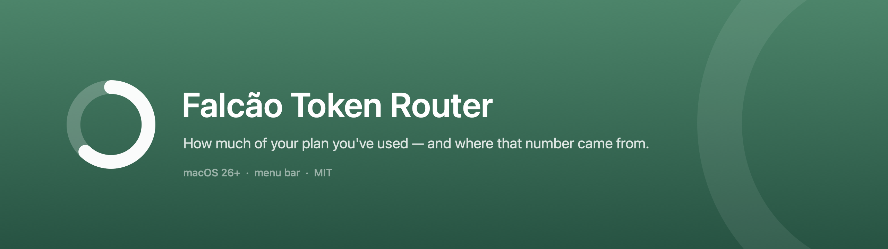

# Falcão Token Router

Keeps several Claude Code accounts in **groups** and switches the active one for
you when it runs out — without ending your session.

**macOS and Windows.** Not a platform with a port: one solution, two native
apps, reading and writing the same files. A group you set up on one means the
same thing on the other.

```
◐ 81%  equipe-2   ← which account is serving you, and how much of it is spent
```

## What it does

You create groups — `trabalho`, `pessoal`, `faculdade` — and sign each account
in through Anthropic's own login flow, inside the app. You set the order and the
threshold. From then on:

```
claude trabalho   → the freest account in the "trabalho" group; swaps at the threshold
claude pessoal    → same, for the "pessoal" group
claude            → straight through to the binary, in ~/.claude
```

The swap happens **inside a live session**. Claude Code re-reads its keychain
item on the next request, so the account changes under a running conversation —
no restart, no `--resume`, no lost context.

## The constraint that designs everything

Anthropic's terms reserve the OAuth token to the official client. So:

- **The app makes no network calls of its own.** Not one. Usage is measured by a
  passive sensor: Claude Code's status line hands us the `rate_limits` block it
  already received from the API, and we read it from stdin.
- **The app never authenticates.** Sign-in runs the official `claude auth login`
  binary in a pty, in an isolated profile. The app watches the output for the
  link and watches the disk for the outcome. It never sees a password or a token.
- **The app never refreshes OAuth.** It copies a secret between keychain items;
  it never mints one.

The price of that is honest and visible: **an idle account shows `pronta`, not a
number.** There is no sample until that account serves a message. The app says so
rather than inventing a percentage.

## How the swap works

Each account has a **home** — `accounts/<uuid>`, its own config profile, its own
credential, written by Claude Code at login. Each group has a **profile**, where
its sessions run.

Activating an account in a group copies the secret from its home into the
group's credential and writes the identity into the group's `.claude.json`.

Where that credential lives is the one thing the two platforms disagree on, and
it is the whole of the platform seam: on macOS it is a **keychain item**, read
and written through `/usr/bin/security`; on Windows it is a **file**,
`<profile>\.credentials.json`. Claude Code picks up the change either way — on
the next request on macOS, and on Windows when the file's mtime changes.

Two rules are what separate this from a shell script that gets it wrong:

- **Mirror before you swap.** While an account is active, it is the *group's*
  item that Claude Code refreshes, and the refresh token rotates on every
  renewal. Before activating anyone else, the fresh token is copied back to the
  leaving account's home. The home is always the truth when the account is idle.
- **One account, one place.** The same account active in two groups would be two
  copies of a rotating refresh token — which kills one of them silently. The
  engine refuses it.

## What it measures

The sensor writes one sample per account, keyed by e-mail. The rotation compares
the **larger** of the 5-hour and 7-day windows against the group's threshold.

A window whose reset has already passed is discarded rather than kept — otherwise
an old sample would leave an account looking permanently full.

Every number on screen carries its provenance: which window it came from, and how
old the sample is. Past an hour it fades; past twelve hours it gets an explicit
mark, because on a shared account an optimistic stale number is the one that
sends you into an account that is already spent.

### The probe, for what the sensor cannot see

Two things never reach the status line's `rate_limits`: the **per-model limit**
(the Fable ceiling that has actually locked accounts here) and any number at all
for an **idle account**, which has never served a message.

So there is a second, deliberate measurement — **Measure accounts** in a group,
or `router measure [group]`:

```
$ router measure trabalho
  equipe-1: 5h 2%   7d 3%    Fable 0%
  equipe-2: 5h 26%  7d 38%   Fable 0%
  equipe-3: 5h 10%  7d 70%   Fable 0%
```

It asks the official binary (`claude --print /usage`) — the same thing that
happens when you type `/usage` yourself. Still no network call of our own, still
no token read. It costs a Node cold start per account, so it is a button and a
command, never a loop; the passive sensor remains the thing that runs every
minute.

Per-model numbers carry their own timestamp, separate from the sensor's, because
the two age at different rates. An account active in a group is always probed
through the **group's** profile, never through its home — probing the home of an
active account would renew with the stale refresh token, rotate the chain, and
drop the live session into "Login expired".

## Install

| | | |
|---|---|---|
| **macOS 26+** | [`FalcaoTokenRouter-<version>.dmg`](../../releases?q=macos-v) | [install guide](macos/README.md) |
| **Windows 10/11** | [`FalcaoTokenRouter_<version>_x64-setup.exe`](../../releases?q=windows-v) | [install guide](windows/README.md) |

Neither build is signed by a paid developer account yet, so each system stops it
once on first run — macOS with the quarantine flag, Windows with SmartScreen.
Each platform's guide says exactly what to click.

> **Releases are tagged per platform** — `macos-v*` and `windows-v*` — so a fix
> on one never waits for the other's calendar. The consequence: GitHub's *latest
> release* link is **ambiguous** here, because it resolves to whichever platform
> released last. Follow a tag, and read the release title: it names the system.

After installing, the shape is the same on both: create a group, sign accounts
in through Anthropic's own flow inside the app, turn on the terminal
integration, and run `claude <group>`.

> **Open a new terminal afterwards.** The integration is a shell function that
> shadows the binary. In a terminal opened before the install, `claude trabalho`
> is just an argument to `claude`, and your session silently opens on the wrong
> account. `router doctor` names that and every other failure mode this app has.

## Languages

English and Brazilian Portuguese, following your system language. Any other
locale falls back to English.

## Privacy

The app runs entirely on your machine. **No server, no telemetry, no analytics,
and no network calls at all.**

**Local reads:** each profile's `.claude.json` (for the account identity Claude
Code wrote there), the status-line samples this app itself writes under
`Application Support`, and `~/.claude/projects/**/*.jsonl` (read-only, for the
token and cost meter).

**The credential:** on macOS the `Claude Code-credentials` keychain items,
through `/usr/bin/security` — the same binary Claude Code uses to write them,
which is what keeps macOS from prompting on every read. On Windows the
`.credentials.json` file of each profile. Either way the app copies the blob
between profiles and **never decodes it to use a token**: neither engine has a
type with a field for one, so no code path can reach a refresh token.

## Development

Two projects, two toolchains, no shared build. Each one's README has its
commands, and each folder has an `agent.md`.

| | | |
|---|---|---|
| [`macos/`](macos/README.md) | Swift 6 / SwiftUI, SPM | `./Scripts/test.sh` |
| [`windows/`](windows/README.md) | Rust / Tauri 2 / Svelte 5 | `.\scripts\test.ps1` |

What they share is not code — it is the **file format on disk**. `config.json`,
the per-account homes and `usage/<email>.json` are written by whichever app is
running, and read by the other. That is the contract a third platform would
implement; [`docs/PORTING.md`](docs/PORTING.md) writes it down.

Code comments are in Portuguese on both sides, by choice — it is the
maintainers' language, and both engines are mostly comments explaining decisions
that were discovered by observation and are expensive to rediscover.

### Architecture

The full map is [`docs/ARCHITECTURE.md`](docs/ARCHITECTURE.md). Both platforms
are built the same way — an engine with no UI, the app, and a CLI the app ships
— which is what lets every rule be tested without instantiating a window.

| | macOS | Windows |
|---|---|---|
| **Engine** — groups, rotation, credential mirroring, the sensor's store | `CCUsageCore` | `router-core` |
| **App** — tray/menu bar, panel, groups, settings, every user-facing string | `FalcaoTokenRouter` | `falcao-token-router` (Tauri + Svelte) |
| **CLI** the app ships — `statusline` (the sensor), `launch`, `is-group`, `rotate`, `measure`, `doctor` | `router` | `router.exe` |

Everything provider-specific sits behind `ProviderAdapter` on both sides — where
the credential lives for a given profile, the `.claude.json` beside or inside
it, the launch command. `RotationEngine` talks only to that interface, so a
second provider is a new adapter, not a new engine — and it is the same seam a
third platform implements.

`AlertPolicy` is pure and takes no clock: the same sequence of snapshots produces
the same alerts, which is what makes rearming testable at all. The `Alert` type
carries the fact — which window, what percentage — never the sentence. Wording
lives in the app target with every other user-facing string.

## Platforms

Two first-class platforms. Neither is the project and neither is a guest: the
repository root holds what belongs to the product, and each system gets a folder
of its own.

```
falcao-token-router/
├─ macos/     Swift 6 / SwiftUI · menu bar · tags macos-v*
├─ windows/   Rust / Tauri 2 / Svelte 5 · notification area · tags windows-v*
├─ docs/      what is true regardless of system
└─ README · CONTRIBUTING · CLAUDE.md
```

The Windows app is not a wrapper or a subset — it is a full native
implementation with its own engine, its own 392 tests and its own installer,
contributed by [@viniventur](https://github.com/viniventur). It reads and writes
the **same files** as the macOS app, which is what makes them one product rather
than two programs with the same name. Each has its own README, CHANGELOG and
release tags, and [`windows/docs/PLATFORM.md`](windows/docs/PLATFORM.md) records
every Windows fact it relies on and how each was verified.

**A third platform is welcome, and the seam is small.** Everything
system-specific sits behind a few points — where the credential lives, process
liveness, the sign-in terminal, the shell hook, the tray UI — and the files the
app reads and writes are the ones Claude Code writes the same way everywhere.
[`docs/PORTING.md`](docs/PORTING.md) maps each piece to what a Linux port needs
to replace, what it can keep, and what it must verify first; the Windows port is
a worked example of answering that document. Open a
[port issue](../../issues/new?template=port.yml) to start one.

## Contributing

Issues and pull requests are welcome, and the project is set up for it:

- [`CONTRIBUTING.md`](CONTRIBUTING.md) — how to build each platform, the branch
  and PR workflow, what fails a PR, and the invariants a change near credentials
  has to preserve.
- [`docs/ARCHITECTURE.md`](docs/ARCHITECTURE.md) — how the swap, the sensor, the
  probe and the sessions registry actually work, and which parts are decided by
  the system you are on.
- Every folder has an `agent.md`: what it's for, what each file does, the
  decisions taken there and why. Read it before touching the folder.
- Issue templates for [bugs](../../issues/new?template=bug_report.yml),
  [features](../../issues/new?template=feature_request.yml) and
  [ports](../../issues/new?template=port.yml). `good first issue` and
  `help wanted` mark what a newcomer can pick up.
- CI runs the string check, the suite and a release build on every PR.

Bug reports: paste the output of `router doctor` (e-mails redacted). It names
the problem in most of the failure modes this app has.

Two things the project won't trade away: **no network calls of its own**, and
**every number says where it came from**.

## Lineage

Forked from [ClaudeTokenCounter](https://github.com/Ulpio/ClaudeTokenCounter) by
Ulpio (MIT), which was the meter this grew out of. The rotation engine, the
groups, the passive sensor and the CLI are new.

## License

MIT — see [LICENSE](LICENSE).
